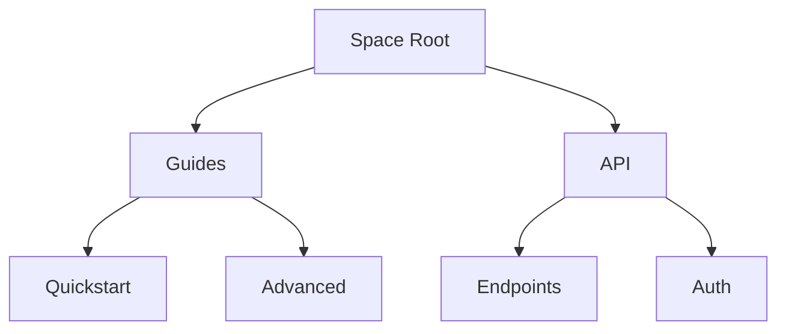

## Overview

AC provides powerful features to help you organize, collaborate on, and maintain your project documentation effectively. Key capabilities include structured folders, team permissions, version tracking, and advanced search.

<Columns cols={2}>
  <Card title="Document Structuring" icon="folder" href="#document-structuring">
    Organize content hierarchically with folders and pages.
  </Card>
  <Card title="Collaboration" icon="users" href="#collaboration">
    Manage permissions and real-time edits with your team.
  </Card>
  <Card title="Version History" icon="git-branch" href="#version-history">
    Track changes and revert to previous versions easily.
  </Card>
  <Card title="Search" icon="search" href="#search">
    Find content quickly across your documentation space.
  </Card>
</Columns>

<Callout kind="info">
  These features work together to create a seamless documentation workflow.
</Callout>

## Document Structuring and Folders

Use folders to create a clear hierarchy for your documentation. You can nest folders and pages to match your project's structure.

<Steps>
  <Step title="Create a Folder" icon="folder-plus">
    Navigate to your space root and select "New Folder". Name it based on your project section, like "API Reference".
  </Step>
  <Step title="Add Pages" icon="file-plus">
    Inside the folder, create new pages. Drag and drop to reorder.
  </Step>
  <Step title="Nest Folders">
    Right-click a folder to create subfolders for deeper organization.
  </Step>
</Steps>



## Collaboration and Permissions

Invite team members and control access levels. Permissions ensure secure collaboration.

<Tabs>
  <Tab title="Viewer" icon="eye">
    Viewers can read content but cannot edit.
  </Tab>
  <Tab title="Editor" icon="edit">
    Editors can modify pages and folders.
  </Tab>
  <Tab title="Admin" icon="shield">
    Admins manage permissions and spaces.
  </Tab>
</Tabs>

<CodeGroup tabs="API,CLI">
  ```javascript
  // Invite user via API
  await fetch(`https://api.example.com/v1/spaces/{spaceId}/invites`, {
    method: 'POST',
    headers: { 'Authorization': 'Bearer YOUR_TOKEN' },
    body: JSON.stringify({
      email: 'user@example.com',
      role: 'editor'
    })
  });
  ```
  ```bash
  # CLI invite command
  ac space invite {spaceId} --email user@example.com --role editor
  ```
</CodeGroup>

<ParamField path="spaceId" param-type="string" required="true">
  Unique space identifier.
</ParamField>

<ParamField query="role" param-type="string" required="false">
  Role: `viewer`, `editor`, or `admin`.
</ParamField>

## Version History and Edits

Every change is tracked automatically. View diffs and restore previous versions.

<Expandable title="View History" default-open="true">
  Right-click a page and select "Version History". Compare changes side-by-side.
</Expandable>

<Expandable title="Restore Version">
  Select a version and click "Restore". This creates a new version from the selected one.
</Expandable>

## Search Functionality

Search across your entire space with full-text capabilities.

| Feature | Description |
|---------|-------------|
| Global Search | Finds pages, folders, and content by keywords |
| Filters | By date, author, or type |
| Advanced | Boolean operators like AND, OR |

<Callout kind="tip">
  Use quotes for exact phrases: `"API authentication"`.
</Callout>

To integrate search into your apps:

<CodeGroup tabs="JavaScript,Python">
  ```javascript
  const results = await fetch(`https://api.example.com/v1/spaces/{spaceId}/search?q=query`);
  console.log(results);
  ```
  ```python
  import requests
  response = requests.get(
      'https://api.example.com/v1/spaces/{spaceId}/search',
      params={'q': 'query'}
  )
  print(response.json())
  ```
</CodeGroup>

<ResponseField name="results" field-type="array" required="true">
  Array of matching pages and snippets.
</ResponseField>