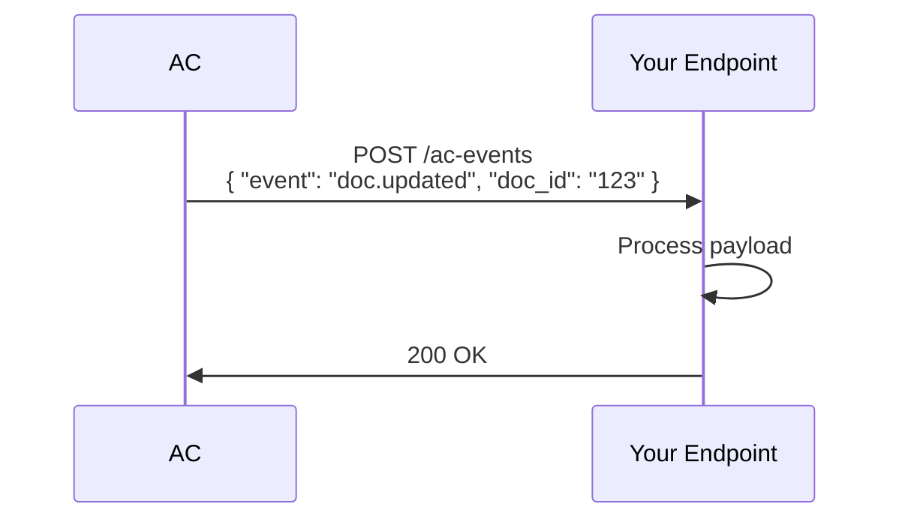

## Overview

AC supports seamless integrations with popular tools to streamline your documentation processes. Sync changes from GitHub repositories, build custom workflows via the API, set up webhooks for real-time notifications, and connect third-party apps for extended functionality.

<Columns cols={2}>
  <Card title="GitHub Sync" icon="github" href="#github-sync">
    Automatically import and sync documentation from your repositories.
  </Card>
  <Card title="API Access" icon="code" href="#api-integrations">
    Build custom integrations using RESTful endpoints.
  </Card>
  <Card title="Webhooks" icon="zap" href="#webhook-setup">
    Receive instant notifications on document updates.
  </Card>
  <Card title="Third-Party Apps" icon="plug" href="#third-party">
    Connect with tools like Slack, Zapier, and more.
  </Card>
</Columns>

## GitHub and Version Control Sync

Link your GitHub repository to AC for automatic documentation syncing. When you push changes to specific branches, AC pulls the latest Markdown files and renders them in your documentation space.

<Callout kind="tip">
  Use GitHub Actions or webhooks to trigger syncs on merge to `main`.
</Callout>

### Setup Steps

<Steps>
  <Step title="Connect Repository" icon="github">
    In your AC dashboard, navigate to Integrations > GitHub and authorize the app.
  </Step>
  <Step title="Select Branch" icon="git-branch">
    Choose the branch to sync, such as `main` or `docs`.
  </Step>
  <Step title="Map Files" icon="file-text">
    Specify paths like `docs/*.mdx` to import.
  </Step>
</Steps>

## API for Custom Integrations

AC provides a REST API at `https://api.example.com/v1` for programmatic access. Create, update, and query documents directly from your applications.

<ParamField path="doc-id" param-type="string" required="true">
  Unique document identifier.
</ParamField>

<ParamField header="Authorization" param-type="string" required="true">
  Bearer `{YOUR_API_KEY}`.
</ParamField>

### Example: Create a Document

<CodeGroup tabs="JavaScript,Python">
  ```javascript
  const response = await fetch('https://api.example.com/v1/documents', {
    method: 'POST',
    headers: {
      'Authorization': 'Bearer YOUR_API_KEY',
      'Content-Type': 'application/json'
    },
    body: JSON.stringify({
      title: 'New Doc',
      content: '# Hello World\nThis is integrated content.'
    })
  });
  const doc = await response.json();
  console.log(doc);
  ```
  ```python
  import requests

  headers = {
      'Authorization': 'Bearer YOUR_API_KEY',
      'Content-Type': 'application/json'
  }
  data = {
      'title': 'New Doc',
      'content': '# Hello World\nThis is integrated content.'
  }
  response = requests.post('https://api.example.com/v1/documents', json=data, headers=headers)
  doc = response.json()
  print(doc)
  ```
</CodeGroup>

## Webhook Setup for Notifications

Configure webhooks to send payloads to your endpoint on events like document creation or updates.

### Events

| Event          | Description                     |
|----------------|---------------------------------|
| `doc.created`  | New document added              |
| `doc.updated`  | Document content changed        |
| `doc.published`| Document goes live              |

<Steps>
  <Step title="Create Webhook" icon="plug">
    Go to Settings > Webhooks > New Webhook.
  </Step>
  <Step title="Add Endpoint" icon="link">
    Enter `https://your-webhook-url.com/ac-events`.
  </Step>
  <Step title="Select Events" icon="zap">
    Choose relevant events and save.
  </Step>
  <Step title="Verify" icon="check-circle">
    Trigger a test event to confirm delivery.
  </Step>
</Steps>



## Third-Party App Connections

Connect AC to popular services using OAuth or API keys.

<Tabs>
  <Tab title="Slack" icon="message-circle">
    Send notifications to a Slack channel on document updates.
    
    <CodeGroup tabs="Webhook URL">
      ```bash
      curl -X POST https://hooks.slack.com/services/YOUR/SLACK/WEBHOOK \
        -H 'Content-type: application/json' \
        -d '{"text": "New doc published in AC: https://docs.example.com/doc-123"}'
      ```
    </CodeGroup>
  </Tab>
  <Tab title="Zapier" icon="zap">
    Create "Zaps" triggered by AC webhooks.
    
    1. In Zapier, choose Webhooks by Zapier as trigger.
    2. Use your AC webhook URL.
    3. Connect actions like email or Google Sheets.
  </Tab>
</Tabs>

<Expandable title="Advanced: Custom OAuth Apps" default-open="false">
  For deeper integrations, register a custom OAuth app in AC settings. Use scopes like `docs:read` and `docs:write`.
</Expandable>

<Callout kind="info">
  Check the [API Reference](/api-reference) for full endpoint details and rate limits.
</Callout>